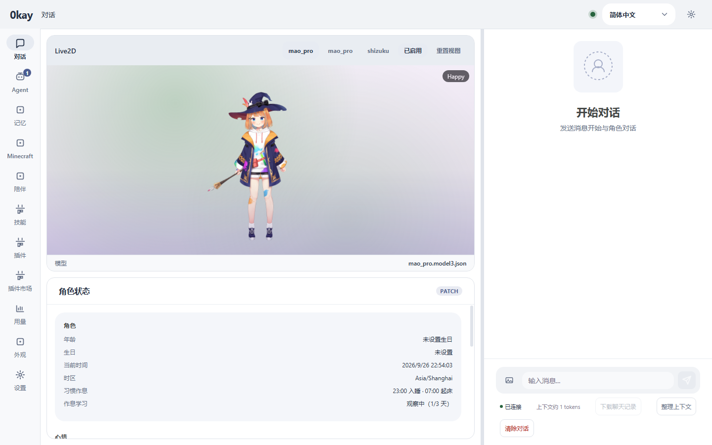
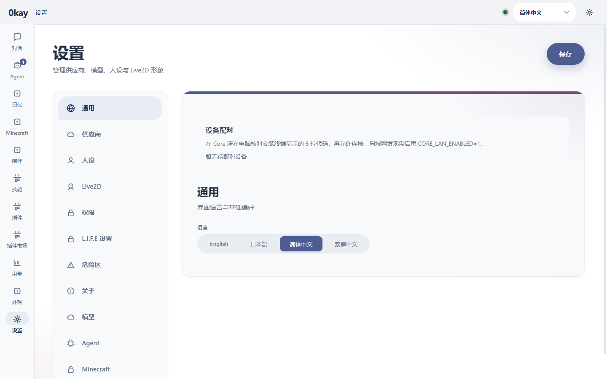
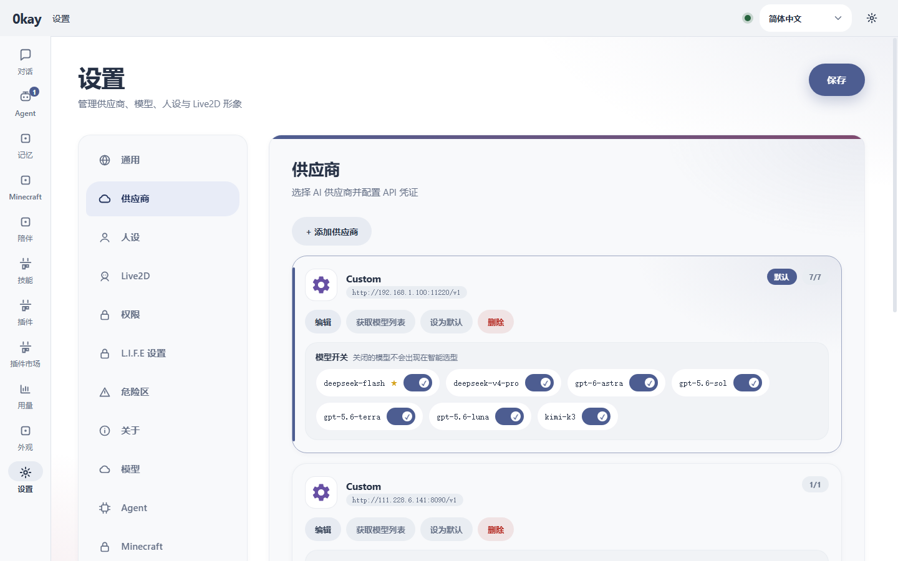

# 0KAY

**A self-hosted AI companion that remembers you — with a real agent underneath.**

*一句话：在自己电脑上跑一个会记事、有情绪、还能帮你干活的 AI 伙伴。*
*(中文说明：[README.zh-CN.md](README.zh-CN.md))*

Most "AI companion" apps are a chat box with a system prompt. 0KAY is built around
two ideas that a chat box cannot do:

- **The companion keeps state.** Emotion, short- and long-term memory, a
  sleep/wake rhythm, relationships and proactive messages. It remembers what you
  told it last week — and can bring it up first.
- **It is also a real agent.** File edits, shell, web and desktop control, behind
  an approval gate. The same character that talks to you can actually do your work.

It runs locally. You bring your own model API key (OpenAI-compatible or
Anthropic-format providers), and your data stays in plain files on your disk.

## What you can do

- **Talk to a companion that remembers.** Conversations feed its memory and
  mood; it has good and bad days, journals, dreams, and reaches out on its own.
- **Give it a face and a voice.** Live2D avatar and TTS.
- **Delegate real work.** A coding/research agent with filesystem, shell, web
  fetch/search and whole-desktop tools. Risky calls wait for your approval.
- **Reach it where you already are.** Chat in the WebUI, or connect QQ / OneBot.
- **Extend everything.** Beyond a small Go core, every capability is a plugin:
  model gateway, persona, agent, TTS, search, Minecraft, and plugin-owned WebUI
  pages. Install, disable or swap each one on its own.
- **Keep it private.** Services bind to loopback by default; provider keys stay
  in Core; data is plain files you own.

## Who this is for

**This is for you if…**

- You want an AI companion whose memory and personality are *yours*, not a
  vendor's, and you care about that staying on your own machine.
- You're comfortable running a few local services (Go / Python / Node, or Docker)
  and pasting in your own model API key.
- You like to tinker: swap models, add plugins, run it on QQ, build a custom page.

**This is probably not for you if…**

- You want a zero-setup cloud app — 0KAY is self-hosted by design.
- You don't want to manage model API keys or ports.

## Screenshots

| Chat | General settings | Provider settings |
|---|---|---|
|  |  |  |

Captured from the running WebUI (`webui`, Vite dev server).

## Quick start

> Node.js 22+ is enough for the package-manager path. Docker Compose covers the
> container path. Running from source also needs Go 1.27+ and Python 3.10+.

Pick **one** of the three options below.

### Docker Compose

```bash
docker-compose up -d      # build and start every service
docker-compose ps         # check status
docker-compose logs -f    # follow logs
docker-compose down       # stop
```

### Package manager (recommended)

```sh
# Standalone repository install (recommended, no git involved)
npm install -g https://codeload.github.com/RazureSOFT/0KAY-pm/tar.gz/main

# Or from a local checkout
npm install -g ./pm

0kay-pm discover
0kay-pm install @razuresoft/0kay-agent
0kay-pm install @razuresoft/0kay
0kay-pm update @razuresoft/0kay-agent
0kay-pm start @razuresoft/0kay
```

`0kay-pm install` builds each module and starts it as a background service
(systemd user unit / LaunchAgent / logon task), so there is nothing else to run
afterwards. Pin a release with `@0.1.2`, check with `0kay-pm status <package>`,
and stop with `0kay-pm stop <package>`.

### From source (development)

```sh
# one-time setup
make deps-python           # pip install -e . for L.I.F.E
make deps-node             # npm install for the agent
npm --prefix webui install # WebUI dependencies
make proto                 # generate protobuf code
```

Then run each service in its own terminal:

```sh
make dev-core     # Core on :50051 (gRPC) and :8080 (HTTP)
make dev-mocr     # mocr on :50052
make dev-life     # L.I.F.E on :50053
make dev-agent    # Agent on :50054
npm --prefix webui run dev   # WebUI on :3000
```

Then open the WebUI and, in Settings, add a provider and your model API key.
Health check: `GET http://127.0.0.1:8080/health`.

### Security

Loopback by default; override with `CORE_BIND_HOST`, `AGENT_BIND_HOST`,
`MOCR_BIND_HOST`, `LIFE_BIND_HOST` only on a trusted network. Put an
authenticated reverse proxy in front to expose HTTP. `CORE_API_TOKEN` makes Core
require a bearer token (exchanged for an HttpOnly `0kay_session` cookie at
`POST /api/auth/session`), a browser access PIN gates the UI, and
`GET /api/providers` never returns provider API keys. See
[docs/security.md](docs/security.md).

## How it fits together

```
WebUI (TS) ──HTTP/WebSocket──┐
QQ/OneBot ──WebSocket───────┤
                             ▼
                       ┌──────────┐
                       │   Core   │  Go — gateway, tasks, plugin registry
                       └────┬─────┘
                            │ gRPC
             ┌──────────────┼──────────────┐
             ▼              ▼              ▼
        ┌────────┐    ┌──────────┐   ┌──────────┐
        │  mocr  │    │  L.I.F.E │   │  Agent   │
        │  Go    │    │ (Python) │   │  (TS)    │
        │ models │    │ persona  │   │  tasks   │
        └────────┘    └──────────┘   └──────────┘
```

- **Core** (Go) — HTTP/WebSocket gateway, plugin registry and health, task
  scheduling, settings, provider credentials. It is the single source of truth.
- **mocr** (Go) — the model gateway: provider access, streaming, retries, and
  think/output model selection.
- **L.I.F.E** (Python) — the companion: persona, emotion, memory, circadian
  rhythm, proactive messages and companion tools.
- **Agent** (TypeScript, [separate repo](https://github.com/RazureSOFT/0KAY-agent))
  — the task engine and its tools.
- **WebUI** (Vue 3) — the single-page app; it only talks to Core over HTTP.

Everything except Core itself is a plugin, so a component can be installed,
updated or disabled on its own. Details: [ARCHITECTURE.md](ARCHITECTURE.md) and
[RUNTIME_CONTRACTS.md](RUNTIME_CONTRACTS.md).

## Documentation

- [Architecture](ARCHITECTURE.md) — component boundaries, data flow, UI patches.
- [Runtime Contracts](RUNTIME_CONTRACTS.md) — task identity, sessions, approvals, persistence.
- [Plugin API](docs/PLUGIN_API.md) — the protobuf contract every plugin speaks.
- [Writing a Plugin](docs/writing-a-plugin.md) — end-to-end plugin guide.
- [HTTP API](docs/HTTP_API.md) — every Core gateway route.
- [Model Catalog](MODEL_CATALOG.md) — fallback model IDs.
- [Releases and Updates](docs/RELEASES.md) — install and one-click updates.

## Requirements

- Go 1.27+
- Python 3.10+
- Node.js 22+
- Docker and Docker Compose

## Project structure

```
0KAY/
├── proto/       # shared Protobuf contracts
├── core/        # Go — gateway, registry, scheduling
├── mocr/        # Go — model gateway
├── life/        # Python — companion (persona, memory, emotion)
├── agent/       # TypeScript — task engine (separate repo)
├── webui/       # Vue 3 single-page app
├── plugin-web/  # plugin-owned web UIs
├── gen/         # generated bindings
└── docker-compose.yml
```

## Development

```powershell
python -B -m unittest discover -s life/tests -v   # L.I.F.E tests
# agent/: npm test; npx tsc --noEmit
# core/ and mocr/: go test ./...
```

## License

MIT
